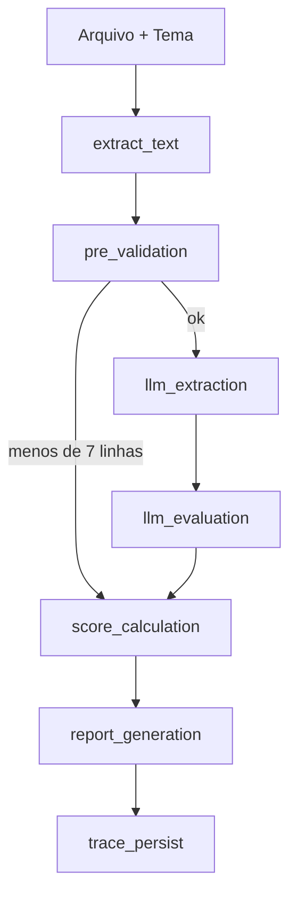
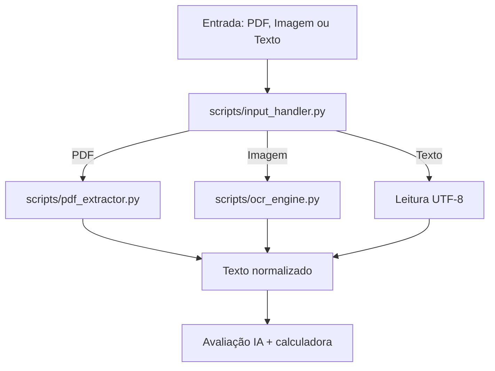

# Documentação do Workflow de Correção

Este documento descreve o workflow **operacional e técnico** do corretor de redações ENEM. A versão estruturada para máquina está em [`workflow.yaml`](../workflow.yaml) — **mantenha os dois arquivos coerentes**.

**Implementação:** `scripts/process_redacao.py` orquestra o fluxo; `scripts/llm_avaliador.py` usa **Ollama** (`llama3.2` por padrão). Sem Ollama, as etapas de IA entram em modo simulado.

---

## 1. Contexto operacional (POP)

| Item | Descrição |
|------|-----------|
| **Problema** | Corrigir redações dissertativo-argumentativas no padrão ENEM (5 competências, 0–200 cada). |
| **Quem executa hoje (manual)** | Professor ou corretor externo, com matriz ENEM e folha/PDF/foto da redação. |
| **Ordem manual** | Receber prova → ler texto → marcar desvios → atribuir níveis por competência → somar → devolver feedback (~15 min/redação). |
| **Objetivo do workflow** | Automatizar ingestão (texto/PDF/OCR), análise assistida por IA, validação aritmética determinística e relatório rastreável para revisão humana (~3 min com co-piloto). |
| **Por que IA aqui** | Há **texto**, **análise** e **decisão** (nível por competência) — ganho operacional claro no estágio 2 da metodologia da disciplina. |

---

## 2. Visão do fluxo (entrada → saída)



---

## 3. Etapas, responsáveis e contratos

| # | Etapa | Responsável | Entrada | Saída | Decisão / validação |
|---|--------|-------------|---------|--------|---------------------|
| 1 | `extract_text` | Orquestrador | Arquivo `.txt/.pdf/.imagem` | `texto_extraido` | Erro de formato → aborta |
| 2 | `pre_validation` | Orquestrador | Texto | `contagem_linhas`, `motivo_anulacao?` | &lt; 7 linhas → anulação (pula IA) |
| 3 | `llm_extraction` | IA (Ollama) | Texto + tema | JSON `pontos_interesse` | Schema `schemas/pontos_interesse.json` |
| 4 | `llm_evaluation` | IA (Ollama) | Texto + tema + pontos + `contrato.yaml` | `notas`, `comentarios` | Notas ∈ {0,40,…,200}; retry se calculadora falhar |
| 5 | `score_calculation` | **Tool Python** | `notas`, `motivo_anulacao?` | `nota_final`, `status` | `calculadora_notas.py` — soma e valida |
| 6 | `report_generation` | Orquestrador | Resultado consolidado | `.md` em `relatorios/` | — |
| 7 | `trace_persist` | Orquestrador | Histórico de etapas | `.json` + `.log` em `logs/` | — |

### Tool calling (papel da IA vs Python)

- **IA (Ollama):** classificar trechos (`pontos_interesse`) e **sugerir** notas/comentários por competência.
- **Python (`calculadora_notas.py`):** ferramenta determinística invocada pelo **orquestrador** após a IA — valida escala ENEM, aplica anulação e calcula a soma. Evita erros aritméticos do modelo.

---

## 4. Exemplos de payload

### Entrada da CLI

```bash
python -m scripts.process_redacao exemplos/redacao_nota_alta.txt "Desafios para a formação educacional de surdos no Brasil"
```

### Saída — pontos de interesse (etapa 3)

```json
{
  "redacao_id": "redacao_nota_alta",
  "pontos_interesse": [
    {
      "tipo": "desvio_sintatico",
      "trecho": "trecho citado da redação",
      "comentario": "explicação pedagógica",
      "gravidade": "moderada"
    }
  ]
}
```

### Saída — avaliação (etapa 4)

```json
{
  "notas": { "C1": 160, "C2": 160, "C3": 120, "C4": 80, "C5": 120 },
  "comentarios": {
    "C1": "Domínio formal adequado, com poucos desvios.",
    "C2": "Tema desenvolvido de forma consistente."
  },
  "motivo_anulacao": null
}
```

### Entrada/saída — tool `calcular_nota_final` (etapa 5)

**Entrada:**

```json
{
  "notas": { "C1": 160, "C2": 160, "C3": 120, "C4": 80, "C5": 120 },
  "motivo_anulacao": null
}
```

**Saída (sucesso):**

```json
{
  "status": "sucesso",
  "nota_final": 640,
  "detalhes": { "C1": 160, "C2": 160, "C3": 120, "C4": 80, "C5": 120 },
  "mensagens": []
}
```

**Saída (erro — dispara retry na IA):**

```json
{
  "status": "erro",
  "mensagens": ["Nota inválida para C1: 150. Deve ser múltiplo de 40."]
}
```

---

## 5. Fluxo técnico de ingestão



---

## 6. Chamadas à IA (Ollama)

### 6.1 Extração (pontos de interesse)

- **Módulo:** `scripts/llm_avaliador.extrair_pontos_interesse`
- **Prompt (resumo):** corretor ENEM; retornar JSON conforme schema; 3–12 pontos.
- **Validação:** `scripts/validacao_schema.validar_pontos_interesse`

### 6.2 Avaliação (competências)

- **Módulo:** `scripts/llm_avaliador.avaliar_competencias`
- **Contrato:** resumo de `contracts/contrato.yaml` injetado no system prompt.
- **Regras:** apenas notas 0, 40, 80, 120, 160, 200; C2 = 0 em fuga total ao tema.

### 6.3 Cálculo (tool Python)

- **Módulo:** `scripts/calculadora_notas.calcular_nota_final`
- Invocado por `avaliar_redacao()` / `process_redacao.py`, não diretamente pelo modelo.

---

## 7. Evidências e rastreio

| Evidência | Local |
|-----------|--------|
| Relatório final | `relatorios/correcao_*.md` |
| Trace estruturado | `logs/trace_*.json` |
| Log textual | `logs/trace_*.log` |
| Testes | `tests_workflow/` |
| Exemplo executado | `relatorios/correcao_redacao_nota_alta_*.md` |

---

## 8. Limitações conhecidas

- Modelos locais (Llama 3.2) podem inconsistência em comentários vs notas — a calculadora garante apenas a **escala numérica**.
- OCR depende de Tesseract instalado e qualidade da imagem.
- OCR de imagem depende da qualidade da foto e do Tesseract (`exemplos/redacao_2.JPG`).
- PDF digital disponível em `exemplos/redacao_3.pdf`.
