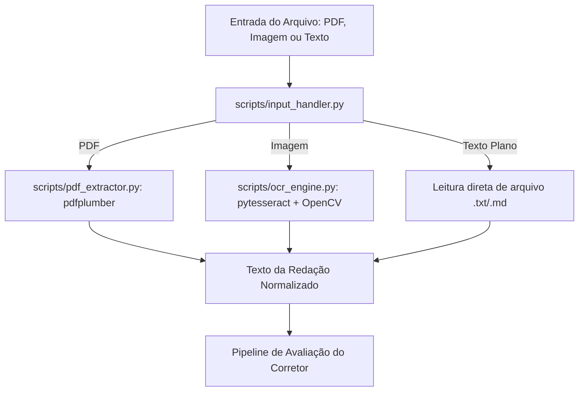

# Documentação do Workflow de Correção

Este documento detalha o pipeline técnico do corretor de redações, especificando como as chamadas à Inteligência Artificial (LLMs) são orquestradas.

## Fluxo Geral de Ingestão e Processamento

Antes do início da avaliação por inteligência artificial, o workflow realiza a ingestão e a padronização do texto a partir de diferentes formatos de entrada:



## Fluxo de Execução da Avaliação

O pipeline de avaliação é dividido em três chamadas principais:

### 1. Chamada de Extração (Pontos de Interesse)
**Objetivo**: Analisar o texto criticamente e isolar partes importantes (desvios de gramática, conectivos, argumentos).
*   **Entrada**: Texto da redação, Tema.
*   **Prompt de Sistema (Resumo)**: "Você é um professor de gramática. Analise a redação fornecida e extraia uma lista de desvios ortográficos, sintáticos e falhas de coesão, bem como pontos positivos (repertório). Retorne estritamente um JSON conforme o schema exigido."
*   **Saída**: Objeto JSON validado contra o `pontos_interesse.json`.

### 2. Chamada de Avaliação (Competências)
**Objetivo**: Julgar o texto qualitativamente frente às competências do `contrato.yaml`.
*   **Entrada**: Texto da redação, Tema, JSON gerado na etapa 1, `contrato.yaml`.
*   **Prompt de Sistema (Resumo)**: "Você é um corretor oficial. Baseado nos desvios extraídos e nas regras definidas no contrato YAML, atribua um nível para cada uma das 5 competências. Justifique brevemente cada nota."
*   **Saída**: Estrutura JSON/Dicionário contendo as chaves `C1`, `C2`, `C3`, `C4`, `C5` e as notas sugeridas.

### 3. Chamada de Cálculo e Validação (Tool Calling)
**Objetivo**: Validar matematicamente as notas e formatar o relatório final.
*   **Ação**: A LLM orquestradora invoca a ferramenta (função) definida pelo script Python `calculadora_notas.py`.
*   **Argumentos Passados pela IA**: 
    ```json
    {
      "notas": {"C1": 160, "C2": 120, "C3": 120, "C4": 160, "C5": 120},
      "penalidades_graves": ["nenhuma"]
    }
    ```
*   **Processamento (Python)**:
    *   O script valida se todos os valores pertencem ao contrato (são múltiplos de 40).
    *   O script soma as notas.
    *   Aplica regras de zeramento se for detectada anulação.
*   **Saída Final**: Um objeto com o totalizador das notas, validado, que a plataforma usa para renderizar o resultado ao usuário final.
