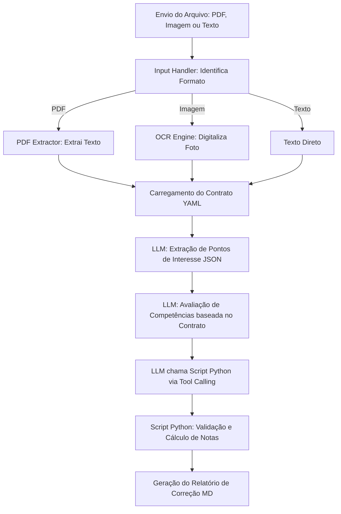

# Documento de Requisitos de Produto (PRD)
## Workflow de Correção de Redações com Inteligência Artificial

---

### 1. Visão Geral do Produto
O **Workflow de Correção de Redações** é um sistema automatizado baseado em IA (LLMs) projetado para analisar, avaliar e atribuir notas a redações escolares e acadêmicas de forma estruturada. 

O sistema utiliza um **contrato estruturado (YAML)** para definir os critérios de avaliação (competências e níveis de nota), identifica **pontos de interesse específicos (JSON)** no texto (desvios gramaticais, acertos de coesão, argumentação) e utiliza uma **calculadora matemática determinística (Python)** via *tool calling* para consolidar a nota final, garantindo precisão matemática e conformidade absoluta com as regras de negócio.

---

### 2. Objetivos
*   **Precisão e Consistência**: Garantir que toda redação seja avaliada estritamente sob os mesmos critérios definidos no contrato, evitando flutuações subjetivas.
*   **Feedback Pedagógico Rico**: Fornecer ao estudante um mapeamento detalhado dos pontos em que ele errou ou acertou no texto, acompanhado de comentários explicativos.
*   **Confiabilidade Aritmética**: Evitar erros comuns de soma de notas de LLMs através da delegação do cálculo para um script Python determinístico via *tool calling*.
*   **Padronização e Flexibilidade**: Permitir a alteração de critérios e competências apenas modificando o arquivo de contrato (`contrato.yaml`), sem necessidade de reescrever o código do orquestrador.

---

### 3. Personas
*   **Ana, a Estudante**: Quer submeter sua redação sobre um determinado tema e receber, em poucos segundos, uma nota realista detalhada por competência e correções pontuais no seu texto para entender onde errou e como melhorar para o ENEM.
*   **Professor Carlos, o Corretor**: Utiliza a ferramenta como um assistente de correção ("co-piloto"). Ele revisa os pontos de interesse sugeridos pela IA e a sugestão de notas, reduzindo o tempo de correção por redação de 15 minutos para 3 minutos.
*   **Gestor Educacional Marcos**: Deseja integrar o motor de correção à sua plataforma de ensino digital por meio de uma API estável que respeite os formatos de dados definidos.

---

### 4. Fluxo de Usuário e Arquitetura do Workflow

O processamento de uma redação segue o fluxo sequencial abaixo:

---

### 5. Requisitos Funcionais (RF)

| ID | Requisito | Descrição |
| :--- | :--- | :--- |
| **RF-01** | **Ingestão de Texto** | O sistema deve aceitar uma string com o texto da redação, o tema proposto e o ID da redação. |
| **RF-02** | **Carregamento de Contrato** | O sistema deve carregar os critérios de avaliação a partir do arquivo `contrato.yaml` para parametrizar a correção dinamicamente. |
| **RF-03** | **Extração de Pontos de Interesse** | A IA deve analisar o texto e listar todos os pontos dignos de nota (erros gramaticais, conectivos destacados, etc.) gerando um JSON estruturado seguindo o padrão de `pontos_interesse.json`. |
| **RF-04** | **Avaliação por Competência** | O sistema deve guiar a LLM para pontuar cada competência cadastrada no contrato, selecionando exclusivamente um dos níveis e notas permitidos pelo `contrato.yaml`. |
| **RF-05** | **Cálculo Determinístico** | A LLM deve realizar uma chamada de função (*tool calling*) enviando os IDs das competências e suas respectivas notas para o script Python `calculadora_notas.py`. |
| **RF-06** | **Tratamento de Nota Zero** | O script Python deve zerar a redação inteira caso critérios críticos de anulação sejam identificados (ex: texto em branco, fuga total ao tema, desrespeito aos direitos humanos, cópia do texto de apoio). |
| **RF-07** | **Geração de Relatório** | O sistema deve consolidar o JSON de pontos de interesse, as notas validadas pelo script Python e as justificativas em um relatório estruturado em Markdown (`workflow.md`/relatório final). |

---

### 6. Requisitos Não-Funcionais (RNF)

| ID | Requisito | Descrição |
| :--- | :--- | :--- |
| **RNF-01** | **Estabilidade de Schema** | Os arquivos JSON de saída devem validar rigorosamente contra os JSON Schemas definidos para evitar falhas de integração. |
| **RNF-02** | **Desempenho** | O processamento completo (análise + tool call + validação) não deve exceder 25 segundos para redações de até 500 palavras. |
| **RNF-03** | **Configurabilidade** | Não deve haver "hardcoding" das competências e pontuações máximas no código da LLM; tudo deve ser lido do `contrato.yaml`. |
| **RNF-04** | **Tratamento de Falhas** | Caso a LLM tente atribuir uma nota que não exista na gradação de níveis do contrato (ex: 150 no ENEM onde os níveis são 120 e 160), o script Python deve retornar um erro de validação instruindo a LLM a reavaliar. |

---

### 7. Regras de Negócio e Validações Especiais

1.  **Regra de Grade Múltipla**: No contrato padrão (tipo ENEM), as notas de cada competência devem obrigatoriamente ser múltiplos de 40 (0, 40, 80, 120, 160, 200). Qualquer outro valor inserido pela LLM é inválido.
2.  **Regra de Anulação (Nota Zero Geral)**:
    *   Fuga ao tema = Nota Final 0.
    *   Folha em Branco / Menos de 7 linhas escritas = Nota Final 0.
    *   Cópia integral dos textos motivadores = Nota Final 0.
3.  **Consistência Pedagógica**: O número de desvios graves mapeados nos *Pontos de Interesse* do JSON deve correlacionar-se logicamente com a nota da Competência I (Norma Culta). Por exemplo, um texto com mais de 5 erros de concordância graves não pode receber nível excelente (200 pontos).

---

### 8. Entregáveis Técnicos (status)

| Entregável | Status |
|------------|--------|
| `contracts/contrato.yaml` | Concluído |
| `schemas/pontos_interesse.json` | Concluído |
| `scripts/calculadora_notas.py` | Concluído |
| `scripts/llm_avaliador.py` (Ollama / Llama 3.2) | Concluído |
| `docs/workflow.md` + `workflow.yaml` | Concluído (documentação operacional + estruturada) |
| Validação JSON Schema (`scripts/validacao_schema.py`) | Concluído |
| Rastreio (`logs/`, `relatorios/`) | Concluído |
